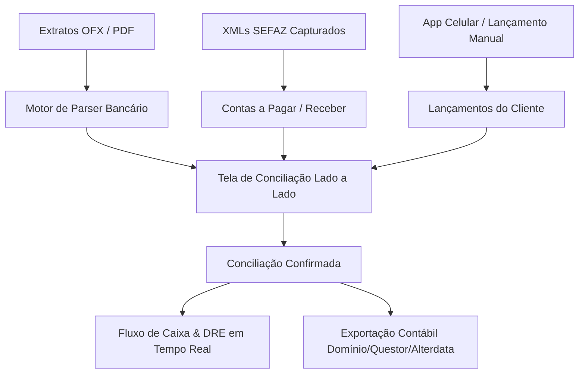

# 🏦 MÓDULO FINANCEIRO & BPO CONTÁBIL VIACONT (ESTILO CONTA AZUL)

> **Documento de Especificação Funcional e Arquitetura**  
> **Plataforma:** ViaNfe / DF-e Hub por Viacont  
> **Versão:** 2.0 BPO Financeiro & Conciliação Inteligente  

---

## 🎯 1. Visão Geral do Módulo

O Módulo Financeiro e BPO Contábil transforma o fluxo de dados fiscais (NF-e, NFC-e, NFS-e) e bancários em uma **Central de Gestão e Conciliação Financeira Lado a Lado** para a Viacont e seus clientes, eliminando digitação manual e automatizando a escrituração contábil.

---

## 📑 2. Pilares de Funcionalidade

### 📥 A. Importador de Extratos Bancários (OFX & PDF)
- **Formatos Aceitos:**
  - Arquivos `.OFX` (Padrão Open Financial Exchange de qualquer banco).
  - Arquivos `.PDF` (Extratos de bancos: Itaú, Bradesco, Santander, BB, Inter, Nubank, Sicoob, Sicredi, C6, etc.).
- **Extração Automática:**
  - Data da transação bancária.
  - Descrição / Histórico bancário (ex: `PIX TRANSF JBS SA`, `TARIFA BANCARIA`, `PAG BOLETO`).
  - Tipo (`Entrada` / `Saída`).
  - Valor monetário e identificador do documento.

---

### ⚖️ B. Tela de Conciliação Bancária Lado a Lado (Estilo Conta Azul)

A tela central de trabalho do BPO Financeiro divide a visualização em duas colunas sincronizadas:

| 🏦 Coluna Esquerda: Transação do Extrato | 🤖 Coluna Direita: Sugestão de Conciliação & Categoria | ⚡ Ação Rápida |
| :--- | :--- | :---: |
| **Data:** 18/08/2026 **Valor:** - R$ 4.837,21 **Histórico:** `PIX ENVIADO JBS S/A` | 🔗 **Vínculo Automático NF-e #1860610** 🏷️ **Categoria:** `01.01.02 - Compras de Carnes e Insumos` 👤 **Fornecedor:** JBS S/A | `[ Conciliar ✓ ]` `[ Editar ✎ ]` |
| **Data:** 18/08/2026 **Valor:** - R$ 89,90 **Histórico:** `TAR MANUTENCAO CONTA` | 🏷️ **Categoria Sugerida:** `03.02.01 - Despesas e Tarifas Bancárias` 📝 **Tipo:** Despesa Financeira | `[ Conciliar ✓ ]` `[ Editar ✎ ]` |
| **Data:** 17/08/2026 **Valor:** + R$ 12.450,00 **Histórico:** `RECEBIMENTO CARTAO REDE` | 🏷️ **Categoria Sugerida:** `01.02.01 - Receita de Vendas no Cartão` 💳 **Adquirente:** Rede / Stone / Cielo | `[ Conciliar ✓ ]` `[ Editar ✎ ]` |

#### 🧠 Regras de Sugestão Inteligente (Motor Viacont AI):
1. **Regra por Fornecedor/CNPJ**: Se o extrato bate com a razão social de uma NF-e já capturada na SEFAZ, o sistema faz o **Match Perfeito** (1 clique para conciliar).
2. **Regra de Aprendizado Histórico**: Se o usuário categorizou `TAR MANUTENCAO` como `Despesas Bancárias` uma vez, o sistema aprende e sugere automaticamente para todos os meses seguintes.
3. **Divisão de Lançamentos (Split)**: Permite vincular 1 pagamento bancário a múltiplas notas ou rateios de centros de custo.

---

### 📱 C. Área do Cliente (Versão Web & Celular)

O cliente da empresa (dono, gerente ou financeiro) possui uma interface limpa e intuitiva:

1. **Lançamentos Rápidos no Celular**:
   - Registrar pagamento ou recebimento manual em 3 toques.
   - Anexar foto do comprovante ou recibo pela câmera do celular.
2. **Campo de Observações Livres do Cliente**:
   - Espaço para o cliente justificar o gasto (ex: *"Pago em dinheiro pelo caixa da noite para freteiro"*, *"Comprado material de limpeza urgente"*).
3. **Painel de Manifestação de Notas**:
   - Visualizar as notas de fornecedores emitidas no dia e clicar em **"Confirmar Mercadoria"** ou **"Não Reconheço"**.

---

### 🏢 D. Versão do Escritório Viacont (Multi-Empresa)

- **Seletor Rápido de Empresas**: O time da Viacont alterna entre clientes com 1 clique.
- **Painel de Pendências de Conciliação**: Mostra quais empresas estão com extratos pendentes de conciliação.
- **Exportador Contábil Padronizado**: Gera arquivos de lançamentos contábeis prontos para importar no sistema contábil (Domínio Sistemas, Questor, Prosoft, Alterdata, etc.).

---

## 🛠️ 3. Próximos Passos de Implementação Técnica

1. **Estrutura de Banco de Dados**:
   - Tabelas: `bank_accounts`, `bank_statements` (extratos), `financial_transactions` (lançamentos), `chart_of_accounts` (plano de contas/categorias), `reconciliation_matches` (regras de match).
2. **Parsers de Extrato**:
   - Módulo Node.js para parsing de `.ofx` e leitor de tabelas em `.pdf`.
3. **Interface de Conciliação (React Tailwind)**:
   - Layout de 2 colunas estilo Conta Azul com atalhos de teclado e confirmação rápida.
4. **Área do Cliente Mobile**:
   - Formulário responsivo para envio de lançamentos, fotos e observações.
