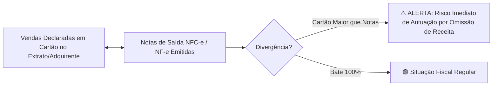

# 📊 MÓDULO CONTÁBIL & PAINEL DO SUCESSO EMPRESARIAL (RADAR FISCAL VIACONT)

> **Documento de Arquitetura & Especificação Funcional**  
> **Plataforma:** ViaNfe / DF-e Hub por Viacont  
> **Versão:** 3.0 Inteligência Contábil, Auditoria Fiscal & Dashboard Executivo  

---

## 🎯 1. Visão Geral da Arquitetura

O **Módulo Contábil & Painel do Sucesso Empresarial** unifica os dados fiscais (NF-e/NFC-e/NFS-e de Entrada e Saída), os dados bancários/adquirentes de cartão e os relatórios contábeis da **Domínio Sistemas** para entregar uma central de **Auditoria Preventiva de Risco Fiscal** e **BI Financeiro de Alta Performance** para o empresário e para os contadores da Viacont.

```mermaid
graph TD
    subgraph 📥 Fontes de Dados
        A[XMLs SEFAZ: Entradas & Saídas]
        B[Extratos Bancários & Maquininhas de Cartão]
        C[Relatórios Domínio Sistemas: DRE & Balanço]
    end

    subgraph 🧠 Motor de Auditoria & Inteligência Fiscal
        D[Cruzamento Cartões x NF-e de Saída]
        E[Cruzamento Compras x Vendas: Alerta de Omissão]
        F[Parser DRE & Balanço Domínio]
        G[Extrator Top 5 Fornecedores & Clientes]
    end

    subgraph 📈 Painel do Sucesso Empresarial
        H[+30 KPIs de Rentabilidade, Liquidez e Margens]
        I[Semáforo de Risco Fiscal de Autuação]
        J[Gráficos de Vendas por Modalidade]
        K[Exportador de Lançamentos Formato Domínio]
    end

    A --> D & E & G
    B --> D
    C --> F
    
    D & E --> I
    F --> H
    A & B --> J
    B & A --> K
```

---

## 📑 2. Módulos & Recursos Detalhados

### 1. 📚 Plano de Contas Flexível & Exportação para Domínio Sistemas

- **Plano de Contas Importável**: O contador pode importar o arquivo do Plano de Contas da empresa (exportado da Domínio) ou cadastrar contas padrão.
- **Amarração de Categorias**:
  - *Modo Flexível (BPO Financeiro)*: Lança com categorias simples (ex: `Compras de Carnes`, `Energia Elétrica`).
  - *Modo Contábil Rígido*: Amarra cada categoria diretamente ao código da Conta Débito e Conta Crédito da Domínio Sistemas.
- **Exportador Oficial Domínio Sistemas**:
  - Gera arquivo `.txt` formatado no layout oficial de importação da **Domínio Sistemas** contendo:
    `Código Empresa | Data | Conta Débito | Conta Crédito | Valor | Código Histórico | Complemento do Histórico`.

---

### 2. 📑 Importador de DRE & Balanço Patrimonial (Domínio)

- **Importação Direta**: Faz o parser de relatórios da Domínio em PDF, Excel (.xlsx) ou TXT.
- **Extração Histórica**: Armazena a evolução mensal de:
  - Receita Bruta, Deduções, Receita Líquida, CPV/CMV, Lucro Bruto.
  - Despesas Operacionais, EBITDA, Despesas Financeiras, Lucro Líquido.
  - Ativo Circulante, Estoque, Passivo Circulante, Patrimônio Líquido.

---

### 3. 🚨 Motor de Auditoria & Prevenção de Risco Fiscal (Radar de Autuação)

O sistema realiza cruzamentos automáticos para proteger o cliente contra autuações da Receita Federal e SEFAZ Estadual:



#### A. Cruzamento Cartão de Crédito, Débito e PIX x Tags de Pagamento das Notas de Saída:
- **Leitura da Tag `<pag>` / `<detPag>` / `<tPag>` das Notas de Saída (NFC-e / NF-e)**:
  - O sistema extrai a modalidade exata registrada pelo operador de caixa no PDV da loja:
    - `01` - Dinheiro em Espécie
    - `03` - Cartão de Crédito
    - `04` - Cartão de Débito
    - `17` - PIX Instantâneo
    - `15` - Boleto Bancário
- **Rastreamento Temporal da Venda vs. Liquidação no Banco**:
  - *PIX (D+0)*: Confronto imediato em tempo real no extrato bancário.
  - *Cartão de Débito (D+1)*: Confronto dos lotes de vendas do dia anterior.
  - *Cartão de Crédito (D+30 ou Antecipação)*: Rastreamento do fluxo futuro a receber descontando as taxas de MDR da maquininha.
- **Resolução do Gargalo de Caixa & Prevenção de Fraudes**:
  - Detecta se a equipe do caixa registrou modalidade errada (ex: registrou Dinheiro mas o cliente pagou em PIX/Cartão).
  - Detecta vendas que passaram na maquininha de cartão e o operador não emitiu o cupom/nota fiscal.
  - Alerta imediatamente sobre divergências entre o total vendido no PDV e o total creditado na conta bancária.

#### B. Cruzamento Compras x Vendas (Inconsistência de Margem e Estoque):
- Analisa se o volume de compras de mercadorias no mês foi **superior ao faturamento de vendas**.
- Dispara alerta de suspeita de venda sem nota ou acúmulo desproporcional de estoque fiscal.

---

### 4. 🏆 Rankings Estratégicos & Análise de Concentração

- **Top 5 Fornecedores do Mês / Período**:
  - Ranking ordenado por volume financeiro (R$), quantidade de notas e % de concentração de compras (ex: *1º JBS S/A - R$ 48.370,00 - 45% do total*).
- **Top 5 Clientes do Mês / Período**:
  - Maiores compradores no atacado ou clientes faturados.
- **Gráfico de Pizza: Vendas por Modalidade**:
  - 🍕 Distribuição visual das receitas:
    - Cartão de Crédito (À Vista e Parcelado)
    - Cartão de Débito
    - PIX / Transferência
    - Boleto Bancário
    - Dinheiro em Espécie

---

### 5. 📈 Painel do Sucesso Empresarial (+30 KPIs Executivos)

O Dashboard do empresário e do contador apresenta:

| Grupo de Indicadores | KPIs Monitorados |
| :--- | :--- |
| **💰 Rentabilidade & Lucro** | Margem Bruta (%), Margem Operacional (%), Margem Líquida (%), EBITDA (R$ e %), Ponto de Equilíbrio (Break-Even). |
| **💧 Liquidez & Saúde Caixa** | Liquidez Corrente, Liquidez Seca, Capital de Giro Líquido, Necessidade de Capital de Giro (NCG). |
| **🔄 Prazos & Ciclos** | Prazo Médio de Recebimento (PMR), Prazo Médio de Pagamento (PMP), Giro de Estoque, Ciclo Financeiro. |
| **⚖️ Endividamento & Estrutura** | Endividamento Geral, Grau de Alavancagem, Cobertura de Juros, Composição do Endividamento. |
| **🛡️ Segurança & Risco Fiscal** | Índice de Cobertura Fiscal (Cartão x NF-e), Relação Compras/Vendas, Termômetro de Risco SEFAZ (Verde, Amarelo, Vermelho). |

---

## 🛠️ 3. Especificação do Modelo de Dados

### Novas Tabelas a Criar:
1. `chart_of_accounts` *(Plano de Contas com código Domínio, nome, tipo D/C e nível)*.
2. `category_mappings` *(De/Para entre Categorias do BPO e Contas da Domínio)*.
3. `card_acquirer_sales` *(Extratos de maquininhas de cartão com data da venda, taxa e valor líquido)*.
4. `financial_kpi_snapshots` *(Série histórica dos 30+ KPIs mensais calculados)*.
5. `fiscal_risk_audits` *(Logs de divergências encontradas: Cartão x NF-e e Compras x Vendas)*.
